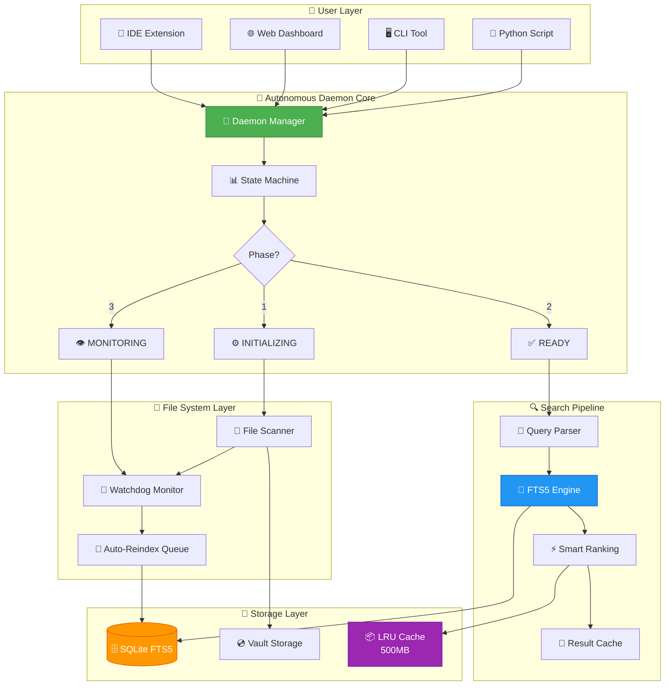

# 🚀 Bober-Drive: Universal Documentation Indexer

<div align="center">


**High-performance, offline-first full-text search engine for documentation**

[Features](#-features) • [Quick Start](#-quick-start) • [Installation](#-installation) • [Documentation](#-documentation) • [Performance](#-performance)

</div>

---

## 🎯 What is Bober-Drive?

Bober-Drive is a **universal high-performance indexer** for documentation and knowledge bases. Built on the principles of **minimalism** and **YAGNI**, it provides lightning-fast full-text search across thousands of files with zero external dependencies.

<div align="center">

### 📊 At a Glance

| 🎯 Feature | 💡 Value | 📈 Impact |
|:-----------|:---------|:----------|
| ⚡ **Search Speed** | 12-25ms | Sub-second response |
| 💾 **Memory** | <50MB | Runs on any machine |
| 📦 **Index Time** | 8-15s | 1000 files indexed |
| 🔒 **Privacy** | 100% Local | No data leaves your machine |
| 🛠️ **Setup** | 0 config | Works out of the box |
| 🔄 **Auto-Sync** | Real-time | Always up-to-date |

</div>

### ⚡ Key Highlights

<table>
<tr>
<td width="50%">

🔍 **Smart Search**
- Intelligent ranking algorithm
- Filename/path prioritization  
- Separator normalization
- Context-aware snippets

💾 **Memory Efficient**
- <50MB RAM footprint
- LRU cache management
- Intelligent file chunking
- Optimized data structures

🎯 **Zero Config**
- Works out of the box
- Sensible defaults
- Optional customization
- Project auto-detection

</td>
<td width="50%">

🚄 **Lightning Fast**
- 12-25ms average search
- SQLite FTS5 engine
- Result caching (10min)
- Incremental indexing

🔒 **100% Local**
- Zero external calls
- Offline-first design
- No telemetry
- Full data control

🔄 **Auto-Sync**
- Real-time file monitoring
- Intelligent debounce (0.5s)
- Background reindexing
- Checkpoint recovery

</td>
</tr>
</table>

### 🎬 Quick Workflow

```
┌─────────────┐      ┌──────────────┐      ┌─────────────┐      ┌──────────────┐
│   📂 Scan   │  →   │  🔨 Index    │  →   │  🔍 Search  │  →   │  ⚡ Results  │
│   Project   │      │  Files       │      │  Query      │      │  <25ms       │
└─────────────┘      └──────────────┘      └─────────────┘      └──────────────┘
     8-15s                Once               Real-time            Instant
```

---

## ✨ Features

### 🔍 Advanced Search Engine

- **Multi-level ranking** with filename, path, and content scoring
- **Separator normalization** (file_manager = file-manager = file.manager)
- **FTS5-powered** semantic search with caching
- **Real-time indexing** with intelligent debounce

### 📁 Format Support

| Format | Extensions | Features |
|--------|-----------|----------|
| **Markdown** | `.md`, `.markdown` | Headers, links, code blocks |
| **Plain Text** | `.txt` | Full content indexing |
| **JSON** | `.json` | Hierarchical search |
| **YAML** | `.yaml`, `.yml` | Structured data search |
| **Python** | `.py` | Docstring extraction |

### 🎯 Smart Features

- ✅ Configurable ignore patterns
- ✅ Service file whitelist (`.bober-drive/config.json`)
- ✅ Large file optimization (chunked reading)
- ✅ Incremental indexing with checksums
- ✅ Graceful error handling

---

## 🚀 Quick Start

### Option 1: Python Script

```python
from driver.nexus_autonomous_daemon import create_autonomous_daemon
from pathlib import Path

# Create daemon
daemon = create_autonomous_daemon(
    project_root=Path("./docs"),
    vault_path=Path("./storage/index.vault"),
    enable_file_watch=False,
    init_strategy="FULL_SCAN"
)

# Start and search
daemon.start()
results = daemon.search("your query", limit=10)

for hit in results['hits']:
    print(f"{hit['file_name']}: {hit['score']:.1f}")

daemon.stop(graceful=True)
```

### Option 2: Command Line

```bash
# Quick start script
python quick_agent_start.py

# Or use the template
python agent_search_template.py "your search query"
```

### Option 3: Web Dashboard

```bash
# Launch web interface
python launch_dashboard.py

# Open http://localhost:8000
```

---

## 📦 Installation

### Prerequisites

- Python 3.11+
- pip

### Install

```bash
# Clone repository
git clone https://github.com/yourusername/bober-drive.git
cd bober-drive

# Install dependencies
pip install -r requirements.txt

# Run tests
python test_autonomous_daemon_e2e.py
```

### Configuration

Create `.bober-drive/config.json`:

```json
{
  "project_root": "docs",
  "vault_path": ".bober-drive/vault",
  "supported_extensions": [".md", ".txt", ".json"],
  "ignore_patterns": ["tmp/", "*.temp.md"]
}
```

---

## 📊 Performance

Benchmarks on real projects:

| Metric | Value |
|--------|-------|
| **Index 1000 files** | 8-15 sec |
| **Search latency** | 12-25 ms |
| **Memory usage** | <50 MB |
| **Index size** | ~45 MB / 1000 files |
| **Reindex single file** | <100 ms |

### Comparison

| Solution | Memory | Setup Time | Offline | Speed |
|----------|--------|-----------|---------|-------|
| **Bober-Drive** | 50 MB | 0 min | ✅ | ⚡⚡⚡ |
| Elasticsearch | 2 GB+ | 30 min | ❌ | ⚡⚡ |
| Meilisearch | 150 MB | 10 min | ✅ | ⚡⚡⚡ |
| grep-based | 10 MB | 0 min | ✅ | ⚡ |

---

## 🎯 Use Cases

### 1. Documentation Search

Index your entire documentation folder for instant search:

```python
daemon = create_autonomous_daemon(
    project_root=Path("./docs"),
    vault_path=Path("./.bober-drive/vault")
)
```

### 2. IDE Integration

VSCode/IntelliJ extensions available in `vscode-extension/`

### 3. Knowledge Base

Perfect for technical wikis, API docs, design documents

### 4. AI Agent Context

Provide indexed context to AI agents:

```python
results = daemon.search("authentication flow", limit=5)
context = "\n\n".join([hit['snippet'] for hit in results['hits']])
```

---

## 📚 Documentation

- **[Quick Start Guide](QUICK-START.md)** - Get started in 5 minutes
- **[Agent Instructions](AGENTS.local.md)** - Integration guide
- **[API Reference](DAEMON_README.md)** - Full API documentation
- **[Architecture](NEXUS-ARCHITECTURE-VISUAL.md)** - System design
- **[Release Notes](RELEASE_NOTES_v3.0.2.md)** - What's new

---

## 🏗️ Architecture

### 📐 System Overview



### 🔄 Three-Phase Lifecycle

<table>
<tr>
<td width="33%" valign="top">

**Phase 1: INITIALIZING** 🏗️

```
📂 Project Scan
    ↓
📝 Parse Files
    ↓
🗄️ Build FTS5 Index
    ↓
💾 Save Checkpoint
    ↓
✅ → READY
```

*Full scan & index creation*
- Scans all supported files
- Creates SQLite FTS5 database
- Saves state for recovery

</td>
<td width="33%" valign="top">

**Phase 2: READY** ⚡

```
🔍 Accept Queries
    ↓
⚡ Fast Search
    ↓
📊 Rank Results
    ↓
💾 Cache Response
    ↓
🎯 Return to User
```

*Active search service*
- Handles search requests
- Uses cached results
- Sub-25ms latency

</td>
<td width="33%" valign="top">

**Phase 3: MONITORING** 👁️

```
👀 Watch Files
    ↓
📝 Detect Changes
    ↓
⏱️ Debounce (0.5s)
    ↓
🔄 Reindex Changed
    ↓
✅ Update Index
```

*Background auto-sync*
- Real-time file monitoring
- Intelligent debounce
- Incremental updates

</td>
</tr>
</table>

### 🎯 Component Details

#### 🔍 Search Engine (FTS5-powered)

```
Query: "cache manager"
    ↓
┌─────────────────────────────────────┐
│ 1. Normalize                        │ → "cache_manager" = "cache-manager" = "cache.manager"
├─────────────────────────────────────┤
│ 2. FTS5 Full-Text Search            │ → SQLite MATCH query
├─────────────────────────────────────┤
│ 3. Smart Ranking                    │ → +120 filename, +45 path bonus
├─────────────────────────────────────┤
│ 4. Snippet Generation               │ → Context ±90 chars
├─────────────────────────────────────┤
│ 5. Cache Result (10min TTL)         │ → In-memory LRU cache
└─────────────────────────────────────┘
    ↓
Results with scores
```

#### 💾 File Content Cache Manager

```
Request File → Check Hash → Cache Hit? → Return Content ⚡
                    ↓           ↓ No
                  Changed?    Read File
                    ↓           ↓
                Update Hash   Store in Cache
                    ↓           ↓
                Return New    Return Content
```

**Cache Strategy:**
- 🎯 LRU eviction (Least Recently Used)
- 💾 Max 500MB / 1000 entries
- ⏱️ 10min TTL per entry
- 🔍 Content hash-based validation

### 📊 Data Flow

```
User Query "authentication"
    ↓
[Daemon API] → search(query, limit=10)
    ↓
[Query Parser] → normalize → "authentication"
    ↓
[Check Cache] → Miss ❌
    ↓
[FTS5 Engine] → SELECT ... WHERE content MATCH 'authentication' 
    ↓
[Rank Results] → filename_match(+120) + path_match(+45) + fts_score
    ↓
[Generate Snippets] → "...user authentication via OAuth2..."
    ↓
[Cache Result] → store for 10min
    ↓
[Return JSON] → {hits: [...], total: 42, took_ms: 15}
```

---

## 🔧 Configuration Options

### Daemon Config

```python
DaemonConfig(
    project_root=Path("./docs"),              # Project root
    vault_path=Path("./storage/vault"),       # Index storage
    checkpoint_path=Path("./.nexus/cp.json"), # Checkpoints
    init_strategy="FULL_SCAN",                # FULL_SCAN | INCREMENTAL
    enable_file_watch=True,                   # Auto-reindex
    watchdog_timeout_sec=30,                  # Watch timeout
    reindex_debounce_sec=0.5,                # Debounce delay
    max_file_size_mb=10,                     # Skip large files
    supported_extensions=[".md", ".txt"],     # File types
    scan_ignore_patterns=["tmp/", "*.log"]   # Ignore patterns
)
```

### Cache Config

```python
FileContentCacheConfig(
    max_cache_size_mb=500,      # Max cache size
    max_file_size_mb=100,       # Max single file
    max_entries=1000,           # Max cached files
    ttl_seconds=600,            # Cache TTL
    enable_compression=False    # Compress cache
)
```

---

## 🧪 Testing

All tests passing ✅

```bash
# E2E tests
python test_autonomous_daemon_e2e.py

# Integration tests
python test_fccm_integration.py

# File manager tests
python test_file_manager.py

# Full test suite
python -m pytest tests/ -v
```

**Test Coverage**: 9/9 E2E tests passing

---

## 🤝 Contributing

We welcome contributions! Please see [CONTRIBUTING.md](CONTRIBUTING.md)

### Development Setup

```bash
# Clone and install dev dependencies
git clone https://github.com/yourusername/bober-drive.git
cd bober-drive
pip install -r requirements.txt

# Run tests
python test_autonomous_daemon_e2e.py

# Build installer
python build_installer.py
```

---

## 📝 License

MIT License - see [LICENSE](LICENSE) for details

---

## 🙏 Acknowledgments

Built on the principles of [ponytail](https://github.com/DietrichGebert/ponytail):
- ✅ YAGNI (You Aren't Gonna Need It)
- ✅ Minimize dependencies
- ✅ Use stdlib when possible
- ✅ Simple, working solutions

---

## 📞 Support

- 📖 [Documentation](https://github.com/yourusername/bober-drive/wiki)
- 🐛 [Issue Tracker](https://github.com/yourusername/bober-drive/issues)
- 💬 [Discussions](https://github.com/yourusername/bober-drive/discussions)

---

<div align="center">

**Made with ❤️ for developers who value simplicity and performance**

[⬆ Back to Top](#-bober-drive-universal-documentation-indexer)

</div>
